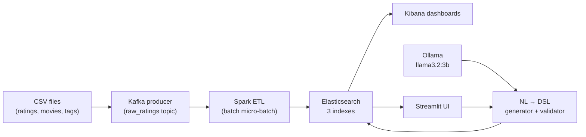

# MovieLens Smart Analytics — Design Document

**Course:** Big Data and AI · **Team size:** up to 3 · **Stage 15 deliverable**

---

## Problem and goal

Movie recommendation platforms and media analysts need to explore large catalogs of user ratings, genres, and free-text tags without writing Elasticsearch DSL by hand. Our goal is an **end-to-end big data pipeline** that ingests the MovieLens 20M dataset, transforms it into searchable analytics indexes, and adds a **natural-language query layer** so non-experts can ask questions in plain English and get validated results from real data.

Success criteria: a working Docker stack, three Elasticsearch indexes loaded from ~20M ratings, Kibana dashboards with evidence-based insights, and measurable AI evaluation on 20 gold questions.

---

## Dataset

| Source | [MovieLens 20M](https://grouplens.org/datasets/movielens/20m/) (GroupLens Research) |
| --- | --- |
| `ratings.csv` | 20,000,263 ratings (userId, movieId, rating, timestamp) |
| `movies.csv` | 27,278 movies (title, genres pipe-separated) |
| `tags.csv` | 465,564 user-applied tags (free text, semi-structured) |

**Semi-structured / unstructured justification:** Ratings are structured, but **genres** (multi-value pipe strings), **titles** (text with embedded year), and especially **tags** (user-generated free text, 38k+ unique values) are semi-structured. The pipeline normalizes genres and tags, indexes titles for full-text search, and uses tag keywords for filter queries — satisfying the course requirement beyond clean tabular data alone.

---

## Architecture

All services run locally via **Docker Compose** on a single machine (~8–12 GB RAM).

---

## Data flow

1. **Ingest:** Python producer reads CSV rows and publishes JSON rating events to Kafka topic `raw_ratings` (sample: 100k rows; full: ~20M).
2. **Transform:** Spark Structured Streaming reads Kafka, joins ratings with movies and aggregated tags, computes per-movie stats, release-year cohorts, and movie×rating-year activity, then **writes directly to Elasticsearch** (no intermediate warehouse).
3. **Serve:** Kibana visualizes aggregates; Streamlit sends user questions to Ollama, parses JSON DSL, validates against index schema, executes on Elasticsearch, and displays hits.
4. **Evaluate:** 20 gold natural-language questions with reference DSL; automated report (`docs/ai_evaluation.md`) measures valid-query rate, index selection, and semantic correctness.

**Year semantics (critical):** `release_year` = when the movie was released; `rating_year` = calendar year of the rating timestamp. Separate indexes prevent mixing cohort and activity questions.

---

## Technologies and rationale

| Technology | Role | Why |
| --- | --- | --- |
| **Docker Compose** | Orchestration | Reproducible single-command stack for graders and demos |
| **Apache Kafka** | Message broker | Simulated streaming ingest; decouples producer from Spark |
| **Apache Spark** | Distributed ETL | Scales to 20M rows; joins, aggregations, direct ES sink |
| **Elasticsearch** | Document store + search | Course NoSQL target; filters, sorts, aggregations on three indexes |
| **Kibana** | Visualization | Dashboards and insight narrative for presentation |
| **Ollama + llama3.2:3b** | Local LLM | Text-to-DSL without API cost; runs offline in Docker |
| **Streamlit** | Demo UI | Fast NL search demo for live presentation |
| **Python** | Glue code | Producers, validators, verification scripts, evaluation |

---

## AI capability (Part B)

**Type:** Natural language → Elasticsearch DSL (course option **6.2d**).

Flow: user question → Ollama prompt with index schema → JSON query → **strict validator** (allowed indexes/fields, no scripts) → Elasticsearch execution → results in UI.

Measured on 20 gold questions (full 20M load): **95%** valid queries, **95%** correct index, **75%** semantic correctness (`docs/ai_evaluation.md`). Failures are mostly malformed aggregations or wrong index on edge cases — the validator prevents unsafe DSL from reaching the cluster.

---

## Main trade-offs

| Choice | Benefit | Cost |
| --- | --- | --- |
| Simulated streaming (batch CSV → Kafka) | Simpler ops; still demonstrates Kafka + Spark | Not true real-time ratings |
| Single-node Elasticsearch | Runs on a laptop | No sharding/failover |
| Small local LLM (3B) | Free, private, fast enough for demo | ~75% semantic accuracy vs. larger models |
| Direct Spark → ES write | Fewer moving parts | No separate object store or Iceberg layer |
| Strict query validator | Safe, predictable queries | Rejects some valid but unusual DSL |

---

## References

- Dataset: https://grouplens.org/datasets/movielens/20m/
- Schema detail: [`docs/schema.md`](schema.md)
- AI evaluation: [`docs/ai_evaluation.md`](ai_evaluation.md)
- Operator guide: [`docs/plan.md`](plan.md)
